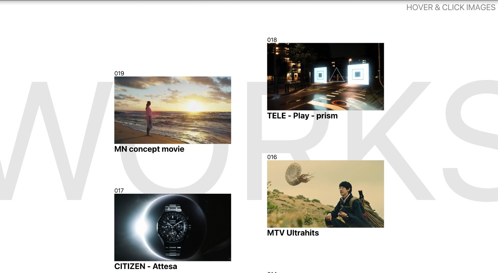

# TAOAJIMA - Three.js Interactive Portfolio Gallery

## Overview

This project, **TAOAJIMA**, is an interactive web-based portfolio gallery designed to showcase creative works, such as concept movies, videos, and visual projects. It features a sleek, modern interface with WebGL effects powered by Three.js. On hover, static images transition to playing videos with distortion and wave effects. Clicking an image expands it to fullscreen mode, displaying the video content. The site includes a preloader animation for smooth asset loading, responsive design for mobile and desktop, and smooth scrolling. The gallery lists projects in a grid-like layout with hover interactions that reveal dynamic content, using custom GLSL shaders for hover distortions and fullscreen transitions.

## Live Demo

[View the live demo of TAOAJIMA here](https://taoajima.vercel.app/)

## Homepage Screenshot



## Features

- **Preloader Animation**: Animates the "WORKS" title while loading images and videos, ensuring a minimum load time for better user experience.
- **Hover Effects**: Images transition to videos with a diagonal wipe effect and wave distortions on hover (desktop only).
- **Fullscreen Mode**: Click to expand a project to fullscreen, playing the video with smooth corner animations.
- **Responsive Design**: Adapts layout for mobile (stacked projects) and tablet/desktop views.
- **Smooth Scrolling**: Powered by Lenis for buttery-smooth scroll behavior.
- **WebGL Shaders**: Custom vertex and fragment shaders handle distortions, aspect ratio corrections, and transitions.
- **Asset Preloading**: Uses `imagesLoaded` for images and native video events for videos to ensure all media is ready before starting the app.

## Technologies Used

- **HTML5**: Structure for the gallery and project list.
- **CSS3**: Styling, including responsive media queries, font loading (Roboto via Google Fonts), and custom variables for block sizing.
- **JavaScript (ES6+)**: Core logic for DOM manipulation, event handling, and integration with libraries.
- **Three.js**: WebGL rendering for interactive meshes, textures (images and videos), and shaders.
- **GSAP (GreenSock Animation Platform)**: Handles animations for preloader, hover states, fullscreen transitions, and text reveals.
- **Lenis**: Smooth scrolling library.
- **GLSL Shaders**: Custom vertex (`vertex.glsl`) and fragment (`fragment.glsl`) shaders for visual effects like waves, distortions, and texture transitions.
- **imagesLoaded**: Library for detecting when images are fully loaded.

## Installation

1. **Clone the Repository**:
   ```bash
   git clone https://github.com/HarshitKumarSahu/TAOAJIMA.git
   cd TAOAJIMA
   ```

2. **Install Dependencies**:
   This project uses npm for package management. Run:
   ```bash
   npm install
   ```
   Key dependencies include:
   - `three`: For WebGL rendering.
   - `gsap`: For animations.
   - `lenis`: For smooth scrolling.
   - `imagesloaded`: For asset preloading.

   Note: Shaders are imported directly in `three.js`, and no additional build tools (e.g., Webpack) are required for a basic setup, but you may want to add one for production.

3. **Serve the Project**:
   Use a local server to avoid CORS issues with shaders and assets. For example, with `live-server`:
   ```bash
   npm install -g live-server
   live-server
   ```
   Or use any static file server (e.g., Python's `http.server` or VS Code Live Server extension).

4. **Asset Preparation**:
   - Place images in the `public/images` directory and reference them via the `data-webgl-media` attribute in `` tags in `index.html`.
   - Add corresponding videos in the `public/videos` directory with class `project_video` (must match image indices).
   - Ensure videos are in a format supported by `THREE.VideoTexture` (e.g., MP4).
   - Sample assets are provided:
     - **Images**: `sample-image-1.jpg`, `sample-image-2.jpg`, etc., located in `public/images`.
     - **Videos**: `sample-video-1.mp4`, `sample-video-2.mp4`, etc., located in `public/videos`.

## Usage

1. **Open in Browser**: Navigate to `http://localhost:8080` (or your server's port) to view the site.
2. **Interactions**:
   - **Hover** (Desktop): Move mouse over project images to see video previews with effects.
   - **Click**: Expand to fullscreen video view. Click anywhere to exit.
   - **Scroll**: Smoothly navigate through the project list.
3. **Customization**:
   - Add more projects by extending the HTML structure in `index.html`. Use the sample structure:
     ```html
     <div class="project_container">
         <span class="list_num">001</span>
         <div class="list_img_cont">
             <a href="#">
                 
                 <video class="project_video" muted loop src="public/videos/sample-video-1.mp4"></video>
             </a>
         </div>
         <span class="list_title">Sample Project</span>
     </div>
     ```
   - Adjust shaders in `fragment.glsl` and `vertex.glsl` for different effects (e.g., wave frequency, distortion strength).
   - Modify CSS variables in `:root` (e.g., `--one-block-size`) for layout tweaks.
4. **Mobile Notes**: Hover effects are disabled on mobile; tap to fullscreen instead.


## Sample Image/Video Options

- **Sample Images**: Included in `public/images/` as `sample-image-1.jpg`, `sample-image-2.jpg`, etc. These are placeholder images (e.g., 1280x720 JPGs) for testing.
- **Sample Videos**: Included in `public/videos/` as `sample-video-1.mp4`, `sample-video-2.mp4`, etc. These are short, loopable MP4 clips compatible with `THREE.VideoTexture`.
- **Homepage Screenshot**: A static image (`homepage-screenshot.jpg`) in `public/images/` representing the portfolio's homepage for documentation purposes.
- **Adding New Assets**:
  - Place new images and videos in the respective `public/` directories.
  - Update `index.html` to reference the new files, ensuring each `` has a corresponding `<video>` with the `project_video` class.
  - Example:
    ```html
    
    <video class="project_video" muted loop src="public/videos/new-project.mp4"></video>
    ```

## Known Issues & Improvements

- **Video Loading Errors**: If videos fail to load, check console for errors (e.g., format issues or CORS). Ensure videos are in MP4 format and hosted correctly.
- **Performance**: On low-end devices, reduce shader complexity (e.g., lower wave frequency in `vertex.glsl`) or limit video resolutions.
- **Accessibility**: Add ARIA labels and keyboard navigation for better accessibility.
- **Testing**: Tested on modern browsers (Chrome, Firefox); ensure WebGL support.
- **Enhancements**:
  - Integrate a build tool like Vite for minification and hot-reloading.
  - Optimize asset delivery for faster load times on the live demo.

## Credits

- **Developer**: Harshit Kumar Sahu
- **Repository**: [https://github.com/HarshitKumarSahu/TAOTAJIMA](https://github.com/HarshitKumarSahu/TAOTAJIMA)
- **Inspiration**: Creative portfolios using Three.js and shaders.
- **Libraries**: Three.js (threejs.org), GSAP (greensock.com), Lenis (github.com/studio-freight/lenis), imagesLoaded (github.com/desandro/imagesloaded).
- **Fonts**: Roboto (Google Fonts), Custom "test" font (Coves Bold).

## License

This project is open-source and available under the MIT License. Feel free to use, modify, and distribute.